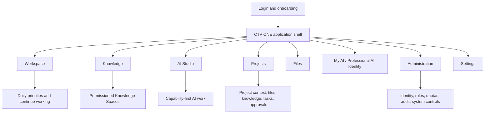

# 01 - Product Architecture

## Positioning

CTV ONE is not a chatbot. It is an Enterprise AI Operating System organized around work.

The product experience should expose understandable capabilities:

- Write
- Research
- Translate
- OCR
- Generate Subtitles
- Enhance Images
- Build Presentations
- Search Knowledge
- Search Archives
- Summarize Meetings

The product experience should not expose ordinary employees to internal implementation names such as Atlas, Forge, Nexus, Ollama, Qdrant, model routing, GPU inference, embeddings, or vector databases.

## Product Principles

1. We build for employees, not AI enthusiasts.
2. Work is the product. AI assists the work.
3. The interface hides technical complexity.
4. Knowledge is an organizational asset.
5. Professional AI Identity belongs to the employee.
6. Professional AI Identity must never become an HR evaluation tool.
7. Security is built into the experience.
8. Every screen must reduce cognitive load.
9. Projects preserve context.
10. Administration must not interfere with daily creative work.
11. Users must always know where they are.
12. The next meaningful action must be clear.
13. AI should anticipate work without interrupting.
14. The interface must feel calm, professional, and trustworthy.
15. The product must scale from ChinoyTV to future multi-company deployments.

## Overall Product Architecture

## Core Product Concepts

| Concept | Meaning |
| --- | --- |
| Workspace | Default employee home organized around today's work |
| Knowledge | Approved organizational knowledge and discoverable sources |
| AI Studio | Capability-first AI work area |
| Projects | Context containers that preserve files, AI outputs, tasks, approvals, and activity |
| Files | Enterprise media and document access layer |
| My AI | Friendly employee-facing entry point for Professional AI Identity |
| Professional AI Identity | Formal governed employee-owned profile |
| Administration | Permissioned governance and system control |
| Settings | User preferences and permitted system settings |

## Existing Frontend Findings

Existing:

- Single route app at `/`.
- Section state controls views rather than route navigation.
- Login exists.
- Overview, AI Assistants, Company Brain, Knowledge Center, Operations, and Infrastructure exist.
- Admin, Projects, Files, My AI, and Settings are not full product areas yet.

Proposed:

- Route-based product IA.
- Permission-aware shell.
- Capability-first AI Studio.
- Project-centered work model.
- Split daily work from administration.

Deprecated terminology:

- Company Brain as primary nav label.
- AI Assistants as primary nav label.
- Infrastructure as ordinary employee nav label.
- Operations as the main home label.

## Architecture Rules

- Product language wins over implementation language.
- Global navigation describes where employees work.
- Context navigation describes where users are inside an object.
- Page actions describe what can be done next.
- Administration is permissioned and separated from daily creative work.
- Technical controls are visible only to authorized technical administrators.

