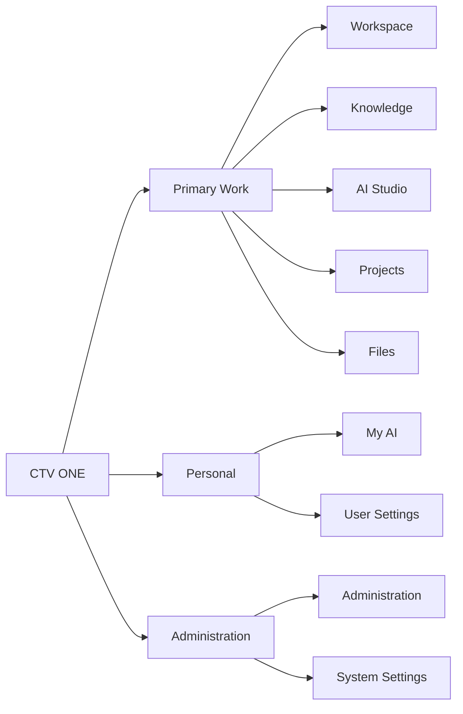

# 02 - Information Architecture

## Global Information Architecture

## Target Primary Navigation

Recommended primary navigation:

- Workspace
- Knowledge
- AI Studio
- Projects
- Files
- My AI
- Administration
- Settings

Recommendation: use **My AI** in employee-facing navigation and **Professional AI Identity** as the formal feature name inside the page, admin views, policy text, and documentation.

Rationale:

- "My AI" is short and approachable.
- "Professional AI Identity" is precise and governance-ready.
- The two-label model lets employees understand ownership while admins understand the formal control.

## Experience Hierarchy

Level 1 - Global Navigation:

- Workspace
- Knowledge
- AI Studio
- Projects
- Files
- My AI
- Administration
- Settings

Level 2 - Context Navigation:

- Project: Overview, Work, Assets, Knowledge, Team, Activity, Settings
- Knowledge Space: Overview, Documents, Required Reading, Contributions, Activity, Settings
- AI Capability: Configure, Run, Results, History, Settings
- Administration: Dashboard, Users, Departments, Roles, Permissions, AI Modules, Quotas, Knowledge Spaces, Audit, Security, System Settings

Level 3 - Page Actions:

- Create
- Upload
- Generate
- Search
- Save
- Share
- Export
- Approve
- Assign
- Archive
- Delete
- Configure

## Consistency Rules

- Level 1 remains stable across the shell.
- Level 2 changes with the active object or product area.
- Level 3 actions are permission-aware and page-specific.
- Restricted actions are hidden or disabled according to the permission state.
- Breadcrumbs identify object context for nested pages.

## Route Recommendations

| Recommended Route | Purpose |
| --- | --- |
| `/` | Redirect to `/workspace` after auth |
| `/login` | Login |
| `/onboarding` | First-time setup |
| `/workspace` | Default employee home |
| `/knowledge` | Knowledge homepage |
| `/knowledge/:spaceId` | Knowledge Space |
| `/knowledge/document/:documentId` | Document detail |
| `/ai-studio` | Capability catalog |
| `/ai-studio/:capabilityId` | Capability detail and run page |
| `/ai-jobs` | AI job list |
| `/ai-jobs/:jobId` | Job detail |
| `/projects` | Project list |
| `/projects/:projectId` | Project overview redirect |
| `/projects/:projectId/overview` | Project overview |
| `/projects/:projectId/files` | Project files |
| `/projects/:projectId/knowledge` | Project knowledge |
| `/projects/:projectId/assets` | Grouped assets |
| `/projects/:projectId/work` | Timeline, tasks, approvals, deliverables |
| `/projects/:projectId/team` | Team |
| `/projects/:projectId/activity` | Activity |
| `/projects/:projectId/settings` | Project settings |
| `/files` | Files home |
| `/files/:fileId` | File detail |
| `/my-ai` | Employee-facing Professional AI Identity home |
| `/my-ai/professional-identity` | Formal profile editor |
| `/settings/profile` | User profile |
| `/settings/notifications` | Notification preferences |
| `/settings/appearance` | Theme and density |
| `/settings/accessibility` | Accessibility preferences |
| `/settings/security` | User security |
| `/settings/privacy` | Privacy controls |
| `/admin` | Admin dashboard |
| `/admin/users` | Users |
| `/admin/departments` | Departments |
| `/admin/roles` | Roles |
| `/admin/permissions` | Permission Matrix |
| `/admin/modules` | AI Modules |
| `/admin/quotas` | Quotas |
| `/admin/knowledge-spaces` | Knowledge Spaces |
| `/admin/integrations` | Integrations |
| `/admin/storage` | Storage |
| `/admin/infrastructure` | Technical administrator AI Infrastructure |
| `/admin/audit` | Audit Logs |
| `/admin/security` | Security |
| `/admin/settings` | System Settings |

## Existing Route Comparison

| Existing Route | Existing Experience | Recommended Route | Migration Impact | Priority |
| --- | --- | --- | --- | --- |
| `/` | Login gate plus all authenticated sections | `/workspace` | Add redirect and routes later | High |
| Section `overview` | Overview dashboard | `/workspace` | Rename and reorganize content | High |
| Section `assistants` | AI Assistants | `/ai-studio` | Replace assistant list with capability catalog | High |
| Section `brain` | Company Brain chat | `/knowledge` and `/ai-studio/search-knowledge` | Split knowledge discovery from capability execution | High |
| Section `knowledge` | Knowledge Center documents | `/knowledge` | Expand into Knowledge Spaces | High |
| Section `operations` | Operations Workspace | `/projects` or `/workspace` modules | Map connector projects into project model | Medium |
| Section `infrastructure` | System health plus admin developer panels | `/admin/infrastructure` | Hide from ordinary employees | High |
| Future Employees | Placeholder | `/admin/users` | Replace placeholder with admin route | High |
| Future Settings | Placeholder | `/settings/*` and `/admin/settings` | Split user/system settings | High |

