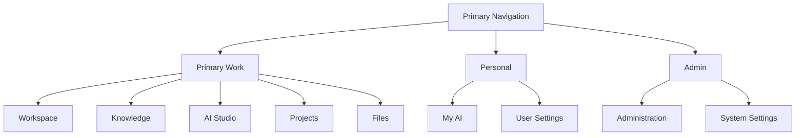

# 03 - Navigation System

## Primary Navigation Hierarchy

## Navigation Behavior

Primary navigation:

- Persistent on desktop.
- Collapsible on tablet.
- Menu sheet or compact bottom navigation on mobile.
- Permission-aware.
- Product-facing.

Context navigation:

- Appears inside object pages such as projects, Knowledge Spaces, admin sections, and capability details.
- Should be stable within the active object.
- Should not repeat global navigation.

Page actions:

- Appear in page header, action bar, toolbar, or sticky footer.
- Are permission-aware.
- Use verbs employees understand.

## Role-Aware Rules

- Derive visibility from effective permissions.
- Do not hardcode around ChinoyTV job titles.
- All employees keep access to approved general Company Knowledge.
- Administration appears only with appropriate permissions.
- Technical status appears only for authorized technical administrators.

## Permission Navigation States

| State | Navigation Behavior |
| --- | --- |
| Hidden | Remove item completely |
| Disabled | Show only if user should understand why unavailable |
| Coming soon | Show only to preview audiences or admins |
| Temporarily unavailable | Show item with status and keep other areas active |
| Quota exhausted | Keep area visible, disable quota-consuming actions |
| Approval required | Show action with request flow |
| Restricted knowledge | Hide resource and metadata |
| Platform restriction | Explain policy when safe |
| Inherited permission | Show source in details, not primary nav |
| Direct override | Show in access detail and audit |

## Navigation Terminology

| Current Term | Proposed Employee Term | Administrator Term | Internal Only? | Migration |
| --- | --- | --- | --- | --- |
| Overview | Workspace | Workspace | No | Rename primary home |
| Company Brain | Knowledge | Knowledge capabilities | No | Replace in primary nav |
| AI Assistants | AI Studio | AI Modules | No | Reframe as capabilities |
| Knowledge Center | Knowledge | Knowledge Spaces | No | Merge into Knowledge |
| Operations | Projects or Workspace | Project operations | No | Split daily work from project context |
| Infrastructure | System Health | AI Infrastructure | Partially | Hide from ordinary employees |
| Employee Memory | My AI | Professional AI Identity | No | Use My AI in nav |
| Generation History | AI Jobs | AI Jobs | No | Use as top-bar utility or subsection |
| Prompt | Request, Instructions, Brief, Input | Prompt template when technical | Partially | Choose by context |
| Model | Capability | AI Service | Yes for employees | Hide in employee UI |
| Provider | AI Service provider | Provider | Yes for employees | Technical admin only |

## Deprecated Terminology

Deprecated employee-facing labels:

- Company Brain
- AI Assistants
- Infrastructure
- Hokkien AI as a top-level navigation item
- Media Intelligence as a backend-style capability group
- Prompt when "request", "brief", or "instructions" is clearer
- Model and provider

