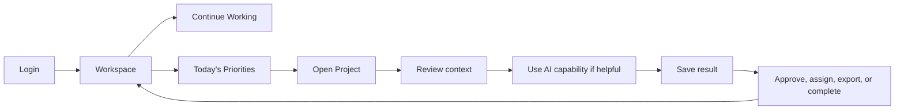

# 04 - Role-Based Workspaces

Navigation must derive from permissions. These role maps are experience examples for ChinoyTV workflows and must remain compatible with future custom roles.

## Role Maps

| Role | Primary Goals | Important Information | Default Modules | Quick Actions | Knowledge Access | Project Access | AI Capabilities | Restricted Areas | Notification Priority | Empty State | Mobile Priority |
| --- | --- | --- | --- | --- | --- | --- | --- | --- | --- | --- | --- |
| Admin | Keep people, access, quotas, and system posture healthy | Access alerts, pending approvals, service status | Admin dashboard, Users, Audit, Knowledge Spaces | Create user, suspend user, review audit | Broad, policy-bound | Organization-wide where permitted | Search Knowledge, reports | Employee private profile details | Security, access, failures | Setup checklist | User lookup, suspension, approvals |
| Executive Producer | Move productions forward and approve work | Active productions, blockers, scripts, approvals | Workspace, Projects, Knowledge, Approvals | Approve, request revision, assign | Production, executive, approved archives | Owned and supervised productions | Summarize, research, script review | Admin controls | Approvals, overdue tasks | No active productions guidance | Approvals and summaries |
| Writer | Draft accurate scripts and research source material | Briefs, source docs, drafts, feedback | Workspace, Knowledge, AI Studio, Projects | Search, write, summarize, submit | Global, production, archives as assigned | Assigned scripts and productions | Write, research, translate, summarize | Admin and sensitive finance/HR | Review feedback, due drafts | Start from brief or knowledge | Continue draft, source review |
| Editor | Prepare media outputs and complete assigned edits | Project files, transcripts, task status, AI jobs | Workspace, Projects, Files, AI Studio | Generate subtitles, enhance image, save asset | Production and project knowledge | Assigned productions | Subtitle generation, OCR, enhancement | Admin | Job completion, file updates | No assigned edits | Active jobs and project files |
| Multimedia Artist | Create and improve media assets | Brand assets, project brief, versions | Workspace, Projects, Files, AI Studio | Generate media, compare, export | Brand, production, project | Assigned creative projects | Image/video generation, enhancement | Admin and restricted business docs | Asset approvals, file comments | Use brand kit starter | Asset review and upload |
| Graphic Artist | Produce visuals and presentations | Brand kit, brief, approval status | Workspace, Projects, Files, AI Studio | Build presentation, enhance image, export | Brand, marketing, project | Assigned design projects | Presentation builder, image generation | Admin | Approval requests | Start with brand kit | Review brief, upload asset |
| Marketing | Create campaigns and proposals | Campaigns, approved messaging, brand assets | Workspace, Projects, Knowledge, Files, AI Studio | Generate proposal, share, export | Marketing, brand, approved sales docs | Campaign projects | Write, presentations, research | Admin and confidential HR | Campaign approvals | Campaign template | Campaign status |
| Sales | Prepare client-facing deliverables | Opportunities, client projects, approved messaging | Workspace, Projects, Knowledge, Files, AI Studio | Generate proposal, search messaging, export | Sales, marketing, product knowledge | Client projects and opportunities | Research, presentation, proposal writing | Admin and internal-only docs | Opportunity deadlines | Start from opportunity | Proposal generation |
| HR scenario | Answer employee requests using approved policy | Requests, policies, approvals | Workspace, Knowledge, Projects if used | Search policy, draft response, publish | HR policies with sensitivity controls | HR projects as assigned | Policy search, summarization, drafting | Private unrelated employee data | Security and approval notices | Request intake guidance | Policy lookup and approval |

## Common Daily Journey Pattern

## Workspace Module Rules

- Modules can be reordered by role defaults and later by user preference if approved.
- Urgent approvals and active work outrank informational cards.
- General Company Knowledge recommendations remain available to every active employee.
- Admin-only modules never appear in employee workspaces unless the user has admin permissions.

