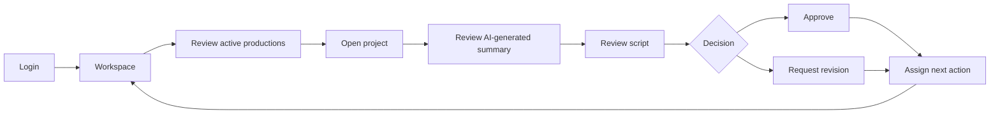
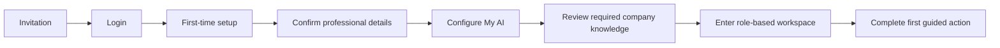

# 05 - User Journeys

## A. Executive Producer

Key screens: Login, Workspace, Projects, Project Overview, Project Work, Approvals.

## B. Editor

Login -> Continue Working -> Open active project -> Review files and transcript -> Open AI Studio capability -> Enhance images or generate subtitles -> Review AI job -> Save result to project -> Mark task complete.

Key screens: Workspace, Project Files, Transcripts, AI Studio capability, AI Job drawer, Task detail.

## C. Writer

Workspace -> Search Knowledge -> Review source documents -> Open project -> Draft script -> Use AI writing capability -> Save version -> Submit for review.

Key screens: Workspace, Knowledge Search, Document Detail, Project Overview, AI Studio Write, Approvals.

## D. Multimedia Artist

Workspace -> Open assigned project -> Review brand assets -> Use creative AI capability -> Generate or enhance media -> Compare versions -> Save approved asset -> Export deliverable.

## E. Graphic Artist

Workspace -> Open project brief -> Review brand kit -> Use presentation or image capability -> Save generated design assets -> Request approval -> Export final assets.

## F. Marketing

Workspace -> Open campaign -> Review project knowledge -> Generate presentation or proposal -> Review brand assets -> Collaborate with Sales -> Export or share.

## G. Sales

Workspace -> Review active opportunities -> Open client project -> Search relevant company knowledge -> Generate proposal or presentation -> Review approved messaging -> Export deliverable.

## H. HR Scenario

Workspace -> Employee request -> Search policy -> Review official source -> Draft response or policy update -> Send for approval -> Publish to appropriate Knowledge Space.

## I. Administrator

```mermaid
flowchart LR
    Login --> Admin[Administration]
    Admin --> Status[Review system status]
    Status --> Users[Open Users]
    Users --> Update[Create or update employee]
    Update --> Role[Assign department and role]
    Role --> Modules[Assign modules and quotas]
    Modules --> Knowledge[Configure knowledge access]
    Knowledge --> Audit[Review audit log]
    Audit --> Confirm[Confirm changes]
```

## J. New Employee Onboarding

## K. Universal Search

Open Ctrl+K -> Search project, file, document, person, or command -> Filter results -> Preview result -> Open in context -> Return without losing previous work.

## L. Permission-Denied Experience

Restricted page or action -> Clear explanation -> Available alternatives -> Optional request access -> No technical authorization error.

