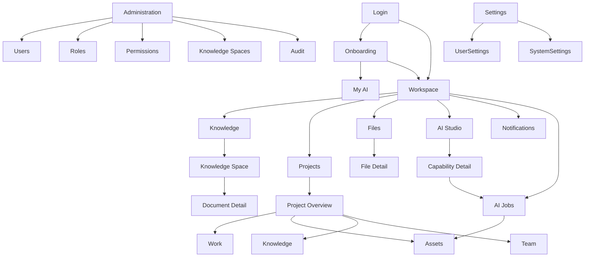

# 06 - Screen Relationship Map

## Screen Relationship Diagram

## Relationship Rules

- Workspace is the default hub.
- Projects preserve context for work, files, knowledge, AI outputs, approvals, and activity.
- AI Studio creates outputs that can be saved to projects or files.
- Knowledge can be global, space-specific, or project-linked.
- Files can be linked, indexed, uploaded, generated, archived, or unavailable.
- Administration controls access but should not become the daily work surface.

## Context Preservation

When users move from a project to AI Studio, Knowledge, or Files:

- Preserve originating project context.
- Offer save-back to the project.
- Show active context in the page header.
- Allow return without losing previous work.

