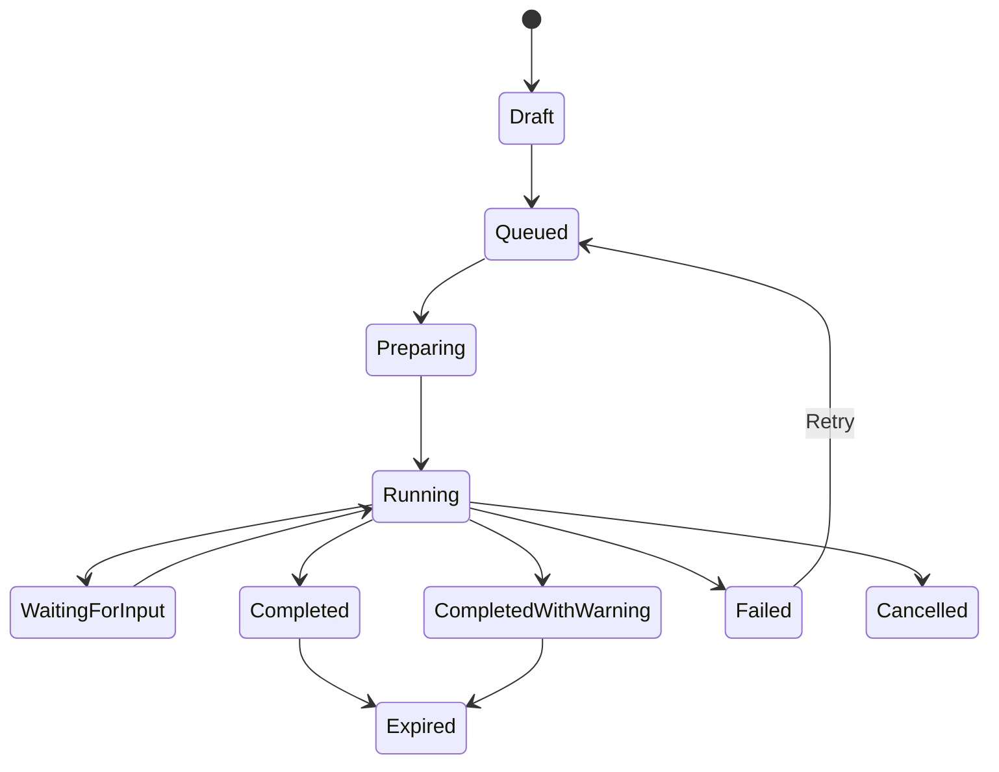

# 08 - AI Studio Architecture

## Principle

AI Studio is capability-first. It is not a list of models.

## Capability Categories

Writing and Research:

- Write
- Research
- Summarize
- Translate
- Meeting Summary

Creative:

- Image Enhancement
- Image Generation
- Video Generation
- Subtitle Generation
- Brand Assets
- Storyboarding

Productivity:

- OCR
- Presentation Builder
- Report Builder
- Archive Search
- Document Extraction

Knowledge:

- Company Knowledge Search
- Policies
- Historical Archive
- Templates
- Project Knowledge

## Capability Card Structure

- Capability name
- Plain-language description
- Allowed inputs
- Expected output
- Project compatibility
- Quota indicator
- Permission state
- Recent use
- Primary action

## Capability Detail Structure

1. Capability overview
2. Project context selector
3. File attachment
4. Instructions or brief
5. Output options
6. Run action
7. Queue/progress state
8. Result review
9. Save to project
10. Download or share
11. Failure recovery

## AI Job Lifecycle

## Permission Handling

- Hidden capabilities are absent.
- Disabled capabilities show explanation only when discoverable.
- Quota exhausted keeps result history but disables run.
- Approval-required capabilities provide request flow.
- Technical infrastructure details appear only to authorized technical administrators.

