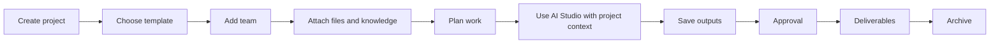

# 09 - Project Architecture

## Definition

Projects are the primary context container. They preserve files, knowledge, AI outputs, work, approvals, team membership, and activity.

## Recommended Project Navigation

To prevent excessive navigation, group project pages:

- Overview
- Work
- Assets
- Knowledge
- Team
- Activity
- Settings

Grouped contents:

| Group | Contains |
| --- | --- |
| Work | Timeline, Tasks, Approvals, Deliverables |
| Assets | Files, AI Assets, Generated Images, Generated Video, Brand Assets |
| Knowledge | Project Knowledge, Transcripts, linked source documents |
| Team | Members, roles, ownership |
| Activity | Project history, comments, AI output history |
| Settings | Status, templates, permissions, archive controls |

## Project-Centered Workflow

## Required Design Model

- Project creation uses templates where available.
- Project status is visible: draft, active, paused, review, completed, archived.
- Project ownership is explicit.
- Team membership drives project access.
- Project knowledge is independently permissioned.
- AI context can include project files, project knowledge, transcripts, and brand assets.
- AI output history remains attached to the project.
- Deletion requires safeguards; archive is preferred.
- Project search searches only permitted project context.

