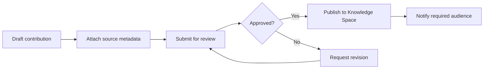

# 10 - Knowledge Architecture

## Principle

Knowledge must feel discoverable and alive. Everyone should access appropriate company knowledge, but sensitive information remains protected.

## Discovery Sections

- Recommended
- Recently Viewed
- Saved
- Required Reading
- Trending
- Recently Updated

## Knowledge Spaces

- Global
- Production
- Marketing
- Sales
- HR
- Finance
- Executive
- Historical Archive
- Policies
- Templates

Each Knowledge Space is independently permissioned.

## Knowledge Screens

- Knowledge homepage
- Knowledge Space page
- Search results
- Document detail
- Version history
- Contribution flow
- Publishing review
- Required reading

## Knowledge Publishing Flow

## Document Detail Requirements

- Title
- Space
- Owner
- Approval status
- Source metadata
- Version history
- Last verified date
- Related documents
- Project links
- Save or pin
- AI summary if permitted
- Citations and source visibility

## Sensitive-Space Behavior

- Restricted spaces do not appear in search or nav for unauthorized users.
- No inaccessible titles, filenames, snippets, owners, or metadata are leaked.
- Request access appears only when the space is discoverable by policy.
- Outdated or unverified content must be clearly marked.

