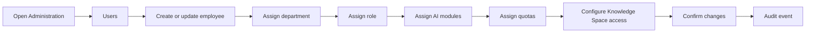

# 13 - Administration Architecture

## Principle

Administration is visually and structurally separated from daily employee work. It appears only to users with appropriate permissions.

## Recommended Sections

- Dashboard
- Users
- Departments
- Roles
- Permissions
- AI Modules
- Quotas
- Knowledge Spaces
- Integrations
- Storage
- AI Infrastructure
- Audit Logs
- Security
- System Settings

AI Infrastructure should be visible only to technical administrators.

## Admin Dashboard Priorities

1. Access risks
2. Pending invitations
3. Quota alerts
4. Knowledge Space access changes
5. Security alerts
6. Integration/storage health
7. Recent audit activity

## Administrator User-Provisioning Flow

## Required Admin Capabilities

- User creation and invitation
- User suspension and reactivation
- Department assignment
- Role assignment
- Custom role creation
- Permission editing
- Module assignment
- Quota assignment
- Knowledge Space access
- Audit review
- System, storage, AI service, and integration health
- Security alerts
- Change confirmation
- Destructive action safeguards
- Bulk actions
- Import and export

## Admin Mobile Limitations

Mobile admin supports urgent work:

- Account lookup
- Status review
- Urgent suspension
- Approvals
- Quota review
- Alerts

Mobile admin does not support full dense Permission Matrix editing.

