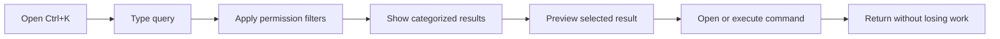

# 15 - Universal Search

## Definition

Ctrl+K opens the Universal Command Center. Search is permission-filtered and context-preserving.

## Universal Search Flow

## Searchable Entities

- Projects
- Files
- Knowledge
- Employees
- Departments
- AI capabilities
- Commands
- Settings
- Recent activity

## Behavior

- Suggested results before query.
- Recent searches when allowed.
- Typo tolerance.
- Category grouping.
- Result preview.
- Result actions.
- Command execution.
- Mobile full-screen overlay.
- Screen-reader result count.

## Permission Rules

- Search never exposes inaccessible resources.
- Restricted titles, filenames, snippets, owners, and metadata do not appear.
- Request access appears only when discoverability is allowed.
- Permission changes clear stale results.

## Ranking Principles

1. Exact match
2. Current context
3. Assigned work
4. Recent activity
5. Organizational relevance
6. Frequently used commands

