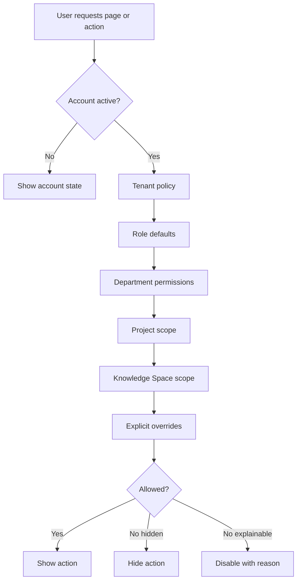

# 17 - Permission Experience

## Permission Model

Recommended verbs:

- View
- Create
- Edit
- Delete
- Upload
- Download
- Generate
- Share
- Approve
- Assign
- Publish
- Archive
- Configure
- Manage Access
- View Audit
- View Sensitive Data

Recommended scopes:

- Own
- Assigned
- Department
- Project
- Knowledge Space
- Organization
- System

## Permission Evaluation Flow

## UX States

- Navigation visibility
- Disabled actions
- Hidden actions
- Read-only states
- Restricted resource states
- Request-access flow
- Temporary access
- Inherited permissions
- Explicit overrides
- Role-based defaults
- Per-user overrides
- Audit implications

Raw permission codes should not appear in employee-facing UI.

## Permission-Denied Experience

Tell the user:

- What they tried to access.
- Why access is unavailable in plain language, when safe.
- What they can do instead.
- Whether they can request access.

Never show technical authorization errors to ordinary users.

