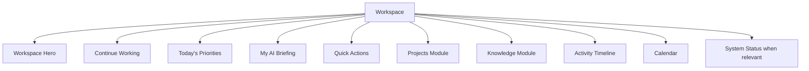

# 01 - Workspace Philosophy

## Core Idea

Employees should never wonder, "What should I do?"

Workspace should already know. It is a work cockpit, not a dashboard. It gathers project context, recent progress, required attention, approved knowledge, AI job status, and suggested next actions into one calm starting point.

## Product Position

CTV ONE is an Enterprise AI Operating System. Employees open it to begin work, continue work, and finish work. AI is present as assistance, not as the center of the interface.

Workspace must avoid:

- Chatbot-first composition.
- Dense executive dashboard grids.
- Technical system language.
- Developer-console patterns.
- Too many equal-weight cards.

Workspace should deliver:

- One clear first action.
- Visible continuity from yesterday.
- Trustworthy context.
- Role-aware quick access.
- Calm escalation for urgent work.

## Workspace Anatomy



## Experience States

| State | Workspace Adaptation |
| --- | --- |
| First Login | Welcomes the user, explains orientation, prompts professional setup, shows required knowledge |
| Returning User | Emphasizes Continue Working and what changed since last session |
| Busy Day | Elevates approvals, deadlines, blocked work, and meetings |
| Quiet Day | Surfaces recommended knowledge, project cleanup, and optional AI assistance |
| Offline | Keeps known context visible if available and disables network actions |
| Maintenance | Shows affected modules only and keeps unrelated work accessible |
| Vacation Return | Summarizes changes over absence, pending approvals, missed deadlines, and recommended catch-up |

## Workspace Memory

Workspace Memory is not generic history. It remembers where work stopped and proposes the next safe resume point.

Example:

```text
Yesterday
Fire Documentary
Subtitle generation completed.
Three archive photos remain for review.

[Resume review]
```

Principles:

- Memory is project-centered.
- Memory is permission-aware.
- Memory should expire or quiet itself when no longer useful.
- Users can dismiss a memory item.
- Dismissal should not delete underlying work history.
- Project switching should preserve the last meaningful stop point per project.

