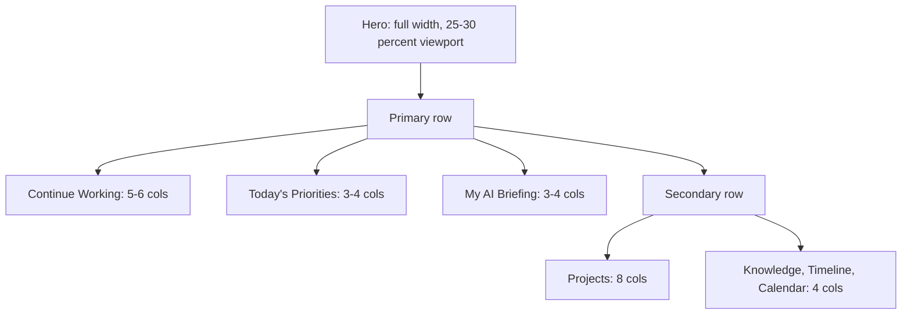
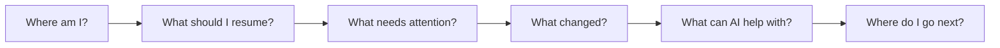

# 02 - Layout System

## Visual Hierarchy

1. Hero: first five-second answer and primary resume action.
2. Primary modules: Continue Working, Today's Priorities, My AI Briefing.
3. Secondary modules: Projects, Knowledge, Activity Timeline, Calendar.
4. Utilities: system status, announcements, low-priority notifications.
5. Footer: rarely needed; avoid using footer for primary work.

## Desktop Grid

Recommended desktop canvas:

- Content max width: 1280-1440 px inside the application frame.
- Outer content margin: 32-48 px.
- Grid: 12 columns.
- Gutter: 20-24 px.
- Hero height: about 25-30 percent of viewport.
- Primary module row: 3-column composition after hero.
- Secondary area: 8-column main plus 4-column utility rail when useful.

## Tablet Layout

- Content margin: 24 px.
- Grid: 8 columns.
- Hero remains full width but shorter.
- Continue Working becomes full width.
- Priorities and My AI become two columns.
- Projects become full width.
- Knowledge and timeline stack below.

## Mobile Layout

- Content margin: 16 px.
- Single-column priority stack.
- Hero becomes compact.
- Continue Working appears immediately after hero.
- Today's Priorities follows.
- Quick Actions use horizontal scroll or compact grid.
- Projects show top three only with View all.
- Knowledge shows one recommendation group at a time.
- Calendar becomes "Next scheduled item".
- Activity Timeline shows latest three entries.

## Reading Flow

## Whitespace Philosophy

Workspace should use fewer, stronger modules. The screen should breathe. Avoid equal-weight dashboards where every card competes. Use whitespace to show priority, not emptiness.

