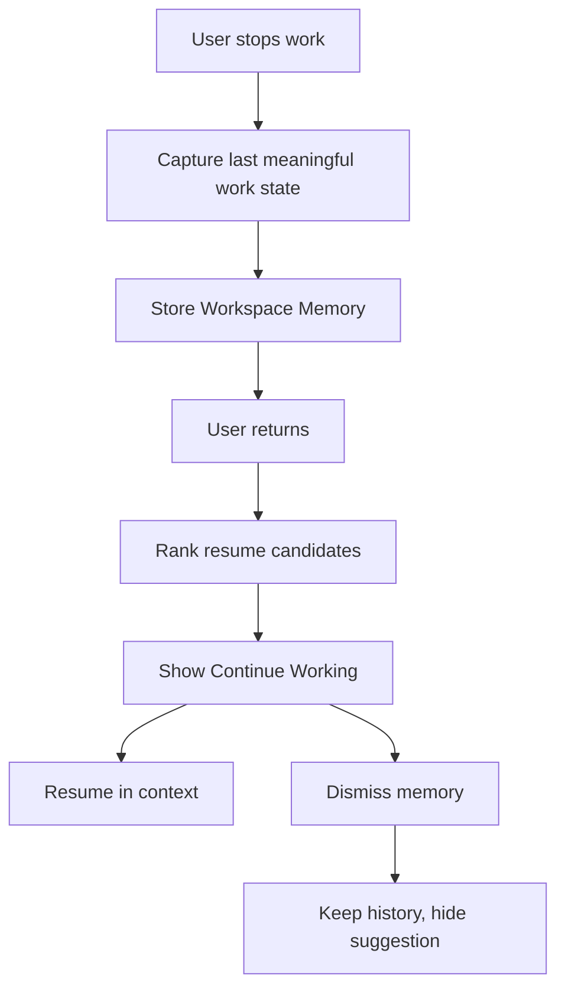

# 04 - Continue Working

## Purpose

Continue Working is the defining Workspace feature. CTV ONE should resume work instead of asking the employee to start from scratch.

## Selection Logic

Rank candidates by:

1. Explicit user-pinned resume item.
2. Unfinished task due soon.
3. Recently active project with unsaved or pending work.
4. Completed AI job awaiting review.
5. Blocked work now unblocked.
6. Assigned project with recent teammate activity.
7. Required approval.

## Workspace Memory Flow

## Multiple Projects

- Show one recommended primary resume item.
- Show up to three secondary resume cards.
- Provide "View all active work" for longer lists.
- Group by project when several items belong together.

## Project States

| Project State | Continue Working Behavior |
| --- | --- |
| Active | Eligible |
| Completed | Show only if review/export remains |
| Paused | Show if user paused it or it became unblocked |
| Archived | Do not suggest unless user pinned before archive and still has access |
| Deleted | Remove from resume suggestions |

## Recent AI Jobs

Completed AI jobs appear when they require human review, save, approval, or export. Running jobs appear in the AI Job area, not as the primary resume item unless they are the user's most important waiting state.

## Interaction Flow

1. User lands on Workspace.
2. Continue Working shows primary resume card.
3. User clicks Resume.
4. CTV ONE opens the exact project, file, approval, or AI result context.
5. Back returns to Workspace with updated memory.

## Privacy

- Workspace Memory is visible only to the user and permitted admins when audit policy requires metadata.
- It must not expose private prompts, hidden files, or restricted knowledge snippets.

