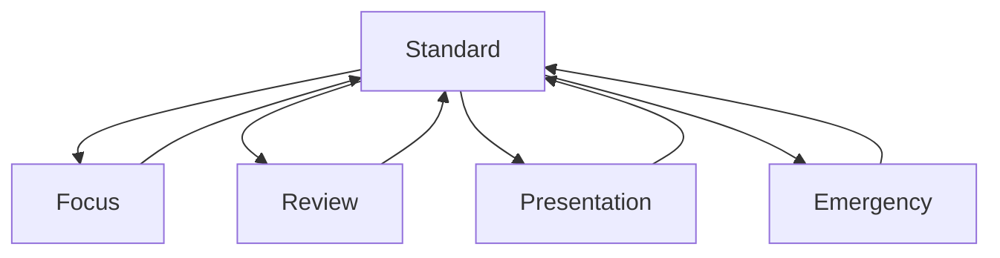

# 11 - Workspace Modes

## Purpose

Workspace Modes let the same Workspace adapt to employee intent without changing the core IA.

## Modes

| Mode | Purpose | Audience | Visible Modules | Hidden or Reduced Modules |
| --- | --- | --- | --- | --- |
| Standard | Balanced daily work | Everyone | Hero, Continue Working, Priorities, My AI, Projects, Knowledge, Timeline | None |
| Focus | Reduce distraction | Writers, editors, artists | Hero, Continue Working, current project, AI jobs | Announcements, broad timeline, non-urgent knowledge |
| Review | Approvals and QA | Producers, managers, admins | Hero, approvals, pending AI review, project changes, timeline | Optional recommendations |
| Presentation | Clean shared view | Producers, sales, marketing | Project summary, deliverables, approvals, selected knowledge | Personal My AI, private notifications |
| Emergency | Urgent operational state | Admins, managers, affected teams | Critical alerts, affected projects, contact paths, status | Non-critical recommendations |

## Workspace Modes Diagram

## Transition Behavior

- Manual mode changes should be reversible.
- Emergency mode can be system-triggered for affected users.
- Presentation mode must hide private content.
- Focus mode should preserve access to search and AI jobs.
- Returning to Standard restores the prior module order.

