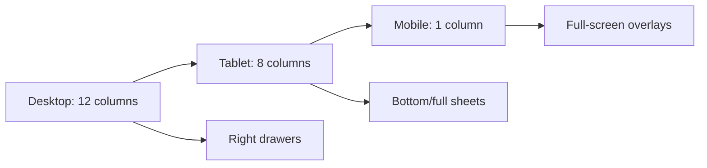

# 12 - Responsive Layout

## Responsive Layout Diagram

## Desktop

- Persistent application sidebar.
- Workspace content max width 1280-1440 px.
- Hero full width.
- Continue Working and primary modules form the first scan area.
- Projects can use wide cards or a two-column grid.
- Knowledge, timeline, calendar, and status can occupy a right rail.

## Tablet

- Collapsible sidebar or rail.
- Hero full width.
- Continue Working full width.
- Priorities and My AI side by side if width allows.
- Projects stack below.
- Drawers become sheets.

## Mobile

Priority order:

1. Hero.
2. Continue Working.
3. Today's Priorities.
4. Quick Actions.
5. AI jobs summary.
6. Projects.
7. Knowledge.
8. Timeline.
9. Calendar.
10. System Status when relevant.

Hidden or collapsed on mobile:

- Broad timeline history collapses to latest three.
- Calendar shows next item only.
- Knowledge shows one group by default.
- Projects show top three.
- System Status appears only when degraded, offline, or maintenance.

## Touch And Reading

- Minimum touch target: 44 by 44 px.
- Avoid dense cards with multiple competing actions.
- Use full-screen search and job review on mobile.

